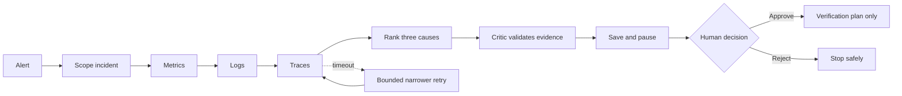

# IncidentLens

IncidentLens is an evidence-first incident investigation agent for distributed systems. It gathers metrics, logs, and traces; ranks competing causes; challenges the leading explanation; persists the case; and interrupts for human approval before any write-like remediation.

[Open the public guided demo](https://incidentlens-demo.siva-babu.chatgpt.site)

## One-line agent definition

IncidentLens helps on-call SREs investigate a multi-signal production incident through a CLI and visual workbench, replacing manual switching among observability tools; it autonomously gathers and validates evidence using Prometheus, OpenSearch, and Jaeger adapters, hands remediation to a human, and succeeds when it produces a cited top-three diagnosis with bounded tool recovery and zero unapproved writes.

## Honest execution modes

IncidentLens treats these as four independent dimensions:

| Dimension | Implemented modes |
|---|---|
| Telemetry | Deterministic replay; read-only live local capture |
| Reasoning | Deterministic evidence rubric; configured OpenAI-compatible model |
| Orchestration | Native Python; LangGraph |
| Action | Simulation and verification-plan preparation only |

The checked-in proof uses deterministic replay plus the deterministic rubric. It proves control flow, evidence handling, failure recovery, checkpointing, interrupt/resume, and the safety boundary. It does **not** claim broad model accuracy or live production telemetry.

## Architecture



Operational fixtures under `incidentlens/scenarios/` contain only alert and telemetry evidence. Expected answers live separately under `evaluation/labels/` and are read only by the evaluator.

### New to the project?

Read the **[visual source-code guide](docs/source-code-visual-guide.md)**. It explains, without assuming an engineering background:

- What IncidentLens does from alert to human decision
- Which technology is used and why
- How each source file participates in an investigation
- How retries, persistence, model validation, and the safety boundary work
- What the project demonstrates and what it deliberately does not claim

## Quick start

Requirements: Python 3.11+ and Node.js 20+ for the static-site tests.

```bash
git clone https://github.com/sivalinb/incidentlens.git
cd incidentlens

python3 -m venv .venv
source .venv/bin/activate
pip install -e '.[langgraph]'
```

### Run the native workflow

```bash
incidentlens investigate payment-unreachable --inject-failure
```

Expected state:

```text
Telemetry mode       deterministic_replay
Orchestrator         native_python
Reasoning            deterministic_rubric
Recovery             narrow query; retry succeeded
Evidence             M-01, L-01, T-01
State                awaiting_approval
Action               none
Production write     none
```

Approve the saved plan without executing a production change:

```bash
incidentlens resume IL-YOUR-ID --approve --note "Evidence reviewed"
```

### Demonstrate real LangGraph interrupt/resume

Invocation 1 creates a durable SQLite checkpoint and pauses:

```bash
incidentlens investigate payment-unreachable \
  --engine langgraph \
  --inject-failure
```

Copy the returned incident ID. In a new terminal process, resume the same checkpoint:

```bash
incidentlens resume IL-YOUR-ID \
  --engine langgraph \
  --approve \
  --note "Reviewed metric, log, and trace evidence"
```

The checked-in generated proof is in:

- `examples/output/langgraph-replay-run.md`
- `examples/output/langgraph-replay-state.json`

### Run with a real configured model

The API key must remain local:

```bash
export LLM_BASE_URL="https://YOUR_PROVIDER/v1"
export LLM_API_KEY="YOUR_LOCAL_SECRET"
export LLM_MODEL="YOUR_MODEL"

incidentlens investigate payment-unreachable \
  --engine langgraph \
  --use-llm \
  --inject-failure
```

The adapter sends only the alert and collected evidence. It requires exactly three JSON hypotheses, validates confidence, rejects unknown citations, and never reads evaluator labels. `examples/output/real-model-run-PENDING.md` remains intentionally pending until a genuine credentialed call is executed.

## Evaluation and tests

```bash
python -m unittest discover -s tests -p 'test*.py' -v
node --test website/tests/*.test.mjs
incidentlens evaluate
```

The suite verifies:

- Evidence/label separation
- Correct metric units and timestamped values
- Three-signal collection
- Changed retry query after an injected Jaeger timeout
- Valid evidence citations
- Independent-label top-1 regression results
- SQLite state persistence
- LangGraph SQLite checkpoint interrupt/resume across app instances
- Human approval and rejection transitions
- No unapproved or implied production write
- Strict model-response contract
- Read-only live client request shapes
- Explicit replay/simulation website labeling

The latest repository verification passed 29 Python tests, 6 website tests, and all 3 deterministic replay evaluations. See [`docs/verification-report.md`](docs/verification-report.md) for the end-to-end evidence.

## Demo and submission assets

- [`docs/demo-runbook.md`](docs/demo-runbook.md) - reliable operator flow and fallbacks
- [`docs/video-script.md`](docs/video-script.md) - timed, word-for-word five-minute narration
- [`docs/submission-checklist.md`](docs/submission-checklist.md) - final links, description, evidence, and claim boundaries
- [`IncidentLens_Final_Step_by_Step_Guide.pdf`](IncidentLens_Final_Step_by_Step_Guide.pdf) - project documentation PDF

## Read-only local telemetry capture

With the OpenTelemetry Astronomy Shop running locally:

```bash
python -m scripts.capture_live_snapshot \
  --service checkout \
  --minutes 10 \
  --metric-query 'up' \
  --output data/captures/checkout-live.json
```

The client reads:

- Prometheus `GET /api/v1/query`
- OpenSearch `POST /*/_search`
- Jaeger `GET /api/traces`

The live snapshot path is deliberately separate from the hosted replay. It does not modify the running demo.

## Static website source

The dependency-free source is under `website/`.

```bash
python3 -m http.server 8080 --directory website
```

Open `http://localhost:8080`. The source shows the four-stage flow: Telemetry -> Analysis -> Agent flow -> Human gate.

## Repository map

```text
incidentlens/
  scenarios/               evidence-only replay fixtures
  workflow.py              native orchestration and persisted approval
  langgraph_adapter.py     StateGraph, SQLite checkpointer, interrupt/resume
  llm.py                   strict OpenAI-compatible model adapter
  live.py                  read-only local telemetry clients
evaluation/labels/         hidden expected answers used only by evaluation
examples/output/           generated deterministic proof and model-run contract
scripts/                   live capture and proof generation
tests/                     Python behavior and safety tests
website/                   static visual workbench and Node tests
docs/                      assignment mapping, video plan, and learning notes
```

## Project requirement mapping

| Requirement | Evidence |
|---|---|
| Multi-step agent | Scope -> three tools -> hypotheses -> critic -> approval |
| Decides what happens next | Explicit nodes, bounded retry classes, stop conditions |
| Calls tools | Replay adapters and read-only Prometheus/OpenSearch/Jaeger client |
| Holds state | Typed incident state plus SQLite persistence |
| Recovers from tool failure | Timeout is recorded; query narrows; second attempt succeeds |
| Human-in-the-loop | LangGraph interrupt and native persisted approval transition |
| Handles non-happy paths | Timeout, empty result, rejection, invalid transition, bad model JSON |
| Measurable completion | Independent labels, citations, multi-signal coverage, recovery, unsafe writes |
| Project documentation | README plus `docs/` and final PDF |
| Demo | Public guided site plus local static source |

## Security and limitations

- No API key is stored, printed, or committed.
- Telemetry reads may proceed autonomously; production changes never do.
- Approval prepares a verification plan only. It does not restart, scale, rollback, or alter a service.
- Three curated cases are regression fixtures, not a representative production benchmark.
- The current live client captures local backend responses but is not the hosted site's data source.
- SQLite is appropriate for this portfolio demo, not a horizontally scaled production control plane.

## Git handoff

Before pushing:

```bash
git status
git add .
git status
git commit -m "feat: publish IncidentLens evidence-first agent"
git push -u origin main
```

After publishing, validate from a clean clone and confirm the GitHub Actions check is green.
