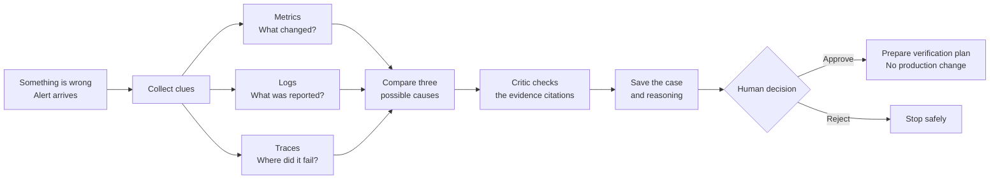
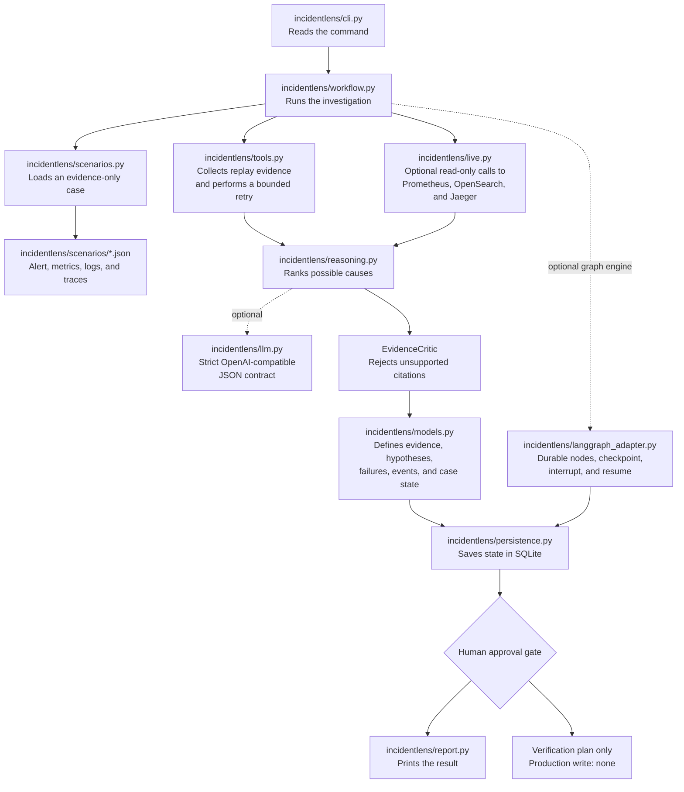
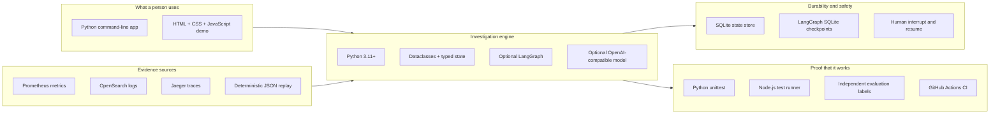
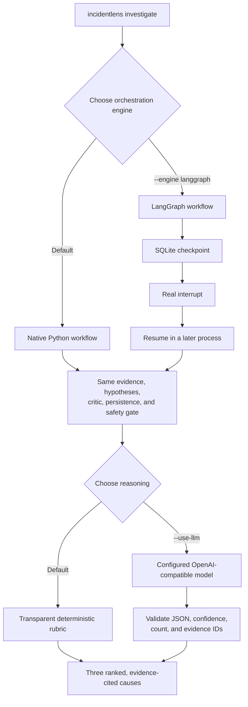
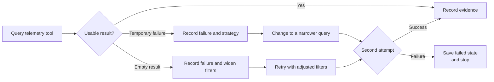
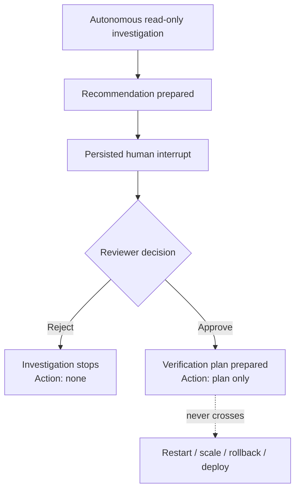

# IncidentLens source code — a visual guide

You do not need a software or operations background to understand this project.

Think of IncidentLens as a **cautious digital investigator**. When a software service has a problem, it gathers three kinds of clues, compares possible explanations, checks its own reasoning, saves the case, and asks a person before anything action-like can continue.

> **Important boundary:** IncidentLens investigates and prepares a verification plan. It does not restart, scale, roll back, or change a production service.

## What the project does



### The same story in everyday language

1. **Alert:** a service reports a symptom, such as checkout failures.
2. **Metrics:** numerical measurements reveal the size and timing of the problem.
3. **Logs:** written system messages reveal what applications observed.
4. **Traces:** a request path reveals which dependency or step failed.
5. **Hypotheses:** the system ranks three possible causes instead of jumping to one answer.
6. **Critic:** every proposed cause must cite evidence that was actually collected.
7. **Memory:** the investigation and its status are saved in SQLite.
8. **Human gate:** a person approves or rejects the proposed plan.
9. **Safe result:** even approval produces only a verification plan—not an automated production change.

## How the source code carries one incident

This diagram connects the user-visible behavior to the exact files that implement it.



Solid arrows show the normal path. Dotted arrows show optional paths selected through command-line flags.

## Technology map



| Technology | Where it appears | Why it is used |
|---|---|---|
| **Python 3.11+** | `incidentlens/`, `scripts/`, `tests/` | Implements the investigation, command line, data models, persistence, and tests. |
| **Python standard library** | `dataclasses`, `typing`, `json`, `urllib`, `sqlite3`, `argparse` | Keeps the core dependency-free and easy to inspect. |
| **LangGraph** *(optional)* | `incidentlens/langgraph_adapter.py` | Turns investigation steps into a durable graph with a real interrupt/resume checkpoint. |
| **OpenAI-compatible chat API** *(optional)* | `incidentlens/llm.py` | Can rank hypotheses using a configured model under a strict JSON and citation contract. |
| **Prometheus** | `incidentlens/live.py` | Reads numerical service metrics. |
| **OpenSearch** | `incidentlens/live.py` | Reads correlated application logs. |
| **Jaeger** | `incidentlens/live.py` | Reads distributed request traces. |
| **SQLite** | `incidentlens/persistence.py`, LangGraph checkpoints | Preserves incident state so a case can stop and resume safely. |
| **JSON** | `incidentlens/scenarios/`, `evaluation/labels/` | Stores repeatable evidence fixtures separately from expected evaluation answers. |
| **HTML, CSS, JavaScript** | `website/` | Provides the dependency-free guided visual demo. |
| **Node.js test runner** | `website/tests/` | Tests the static demo without adding a front-end framework. |
| **GitHub Actions** | `.github/workflows/ci.yml` | Re-runs Python tests, website tests, and evaluation after changes. |

## Two valid ways to run the investigation



- The **native Python path** is the simplest way to read and run the project.
- The **LangGraph path** demonstrates durable agent orchestration and a real human interrupt/resume cycle.
- The **deterministic rubric** makes checked-in test results repeatable.
- The **model path** is optional and requires credentials supplied locally through environment variables.

## What happens when a tool fails

IncidentLens deliberately demonstrates recovery instead of assuming every external system is healthy.



The retry is **bounded to two attempts**. This prevents an agent from looping forever or hiding a persistent backend problem.

## The safety boundary



The dotted line is intentionally never crossed by this project. The code does not contain a production write adapter.

## Repository map for first-time readers

| Path | Plain-language purpose | Start here when you want to understand… |
|---|---|---|
| `incidentlens/cli.py` | The front door | What commands a user can run. |
| `incidentlens/workflow.py` | The investigation coordinator | The complete default sequence from alert to approval. |
| `incidentlens/langgraph_adapter.py` | The graph-based coordinator | Agent nodes, checkpoints, interrupt, and resume. |
| `incidentlens/tools.py` | Repeatable telemetry collectors | How evidence collection and retries work. |
| `incidentlens/live.py` | Read-only live telemetry client | The exact Prometheus, OpenSearch, and Jaeger request shapes. |
| `incidentlens/reasoning.py` | Cause-ranking logic and critic | How three causes are created and checked. |
| `incidentlens/llm.py` | Optional model adapter | How model output is constrained and validated. |
| `incidentlens/models.py` | Shared vocabulary | What evidence, hypotheses, failures, events, and incident state contain. |
| `incidentlens/persistence.py` | Case memory | How state is saved to and loaded from SQLite. |
| `incidentlens/report.py` | Human-readable output | What the terminal prints. |
| `incidentlens/scenarios/` | Evidence-only sample incidents | The replay inputs used by the demo. |
| `evaluation/labels/` | Expected answers kept separate | How the project avoids letting reasoning read the answer key. |
| `tests/` | Behavioral and safety checks | Which success, failure, recovery, and approval cases are verified. |
| `website/` | Public guided demonstration | How the four-stage visual workbench is built. |
| `.github/workflows/ci.yml` | Automated verification | What GitHub checks on every push and pull request. |

## What is demonstrated—and what is not

| Demonstrated by this repository | Deliberately not claimed |
|---|---|
| Three-signal evidence collection | A replacement for a full observability platform |
| A changed query after a simulated timeout | Unlimited or autonomous retries |
| Three ranked causes with evidence citations | Broad diagnostic accuracy across all incidents |
| A critic that removes unknown citations | Proof that a language model can never hallucinate |
| SQLite persistence and LangGraph checkpointing | A horizontally scaled production control plane |
| A human approval/rejection transition | Autonomous remediation |
| Read-only local telemetry request clients | Live production data in the hosted demonstration |
| Repeatable scenarios and independent labels | A statistically representative benchmark |

## A five-minute source-code tour

If you are new to the project, read these files in order:

1. `incidentlens/models.py` — learn the small vocabulary used everywhere else.
2. `incidentlens/workflow.py` — see the full investigation in one place.
3. `incidentlens/tools.py` — see how evidence and recovery are produced.
4. `incidentlens/reasoning.py` — see how causes are ranked and criticized.
5. `incidentlens/persistence.py` — see how the case survives between commands.
6. `incidentlens/langgraph_adapter.py` — compare the graph-based implementation.
7. `tests/test_workflow.py` and `tests/test_langgraph.py` — see executable proof of the important behaviors.

Then run the guided example from the repository root:

```bash
incidentlens investigate payment-unreachable --inject-failure
```

The expected end state is `awaiting_approval`, and the expected production write is `none`.
